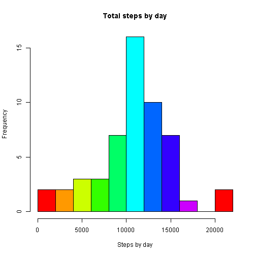
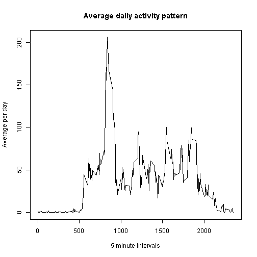
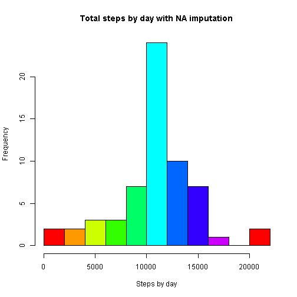
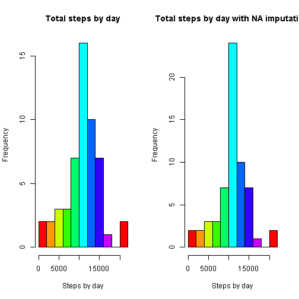
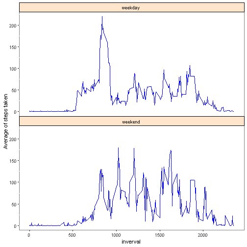

# Analysis of personal movements
### Author: Aldo Bustamante

## Introduction

It is now possible to collect a large amount of data about personal movement using activity monitoring devices such as a Fitbit, Nike Fuelband, or Jawbone Up. These type of devices are part of the “quantified self” movement – a group of enthusiasts who take measurements about themselves regularly to improve their health, to find patterns in their behavior, or because they are tech geeks. But these data remain under-utilized both because the raw data are hard to obtain and there is a lack of statistical methods and software for processing and interpreting the data.

This assignment makes use of data from a personal activity monitoring device. This device collects data at 5 minute intervals through out the day. The data consists of two months of data from an anonymous individual collected during the months of October and November, 2012 and include the number of steps taken in 5 minute intervals each day.

The data for this assignment can be downloaded from the course web site:

Dataset: Activity monitoring data [52K]
The variables included in this dataset are:

* steps: Number of steps taking in a 5-minute interval (missing values are coded as NA)
* date: The date on which the measurement was taken in YYYY-MM-DD format
* Interval: Identifier for the 5-minute interval in which measurement was taken


The dataset is stored in a comma-separated-value (CSV) file and there are a total of 17,568 observations in this dataset.

To carry out this analysis, the data will be loaded from the comma separated text file "activity.csv", which is stored in a local folder, to the variable called "steps"

```r
library(reshape2)
library(ggplot2)
```

```
## Warning: package 'ggplot2' was built under R version 4.0.2
```

```r
setwd("D:/utadeo/programacion en bases de datos/r") 
steps <- read.csv("activity.csv")
```

Below are detailed questions that will be answered with the analysis of the data

### What is mean total number of steps taken per day?

Initially we will determine the amount of NA values in the data frame. 

```r
total.na <- sapply(steps, function(x) sum(is.na(x)))
print(total.na)
```

```
##    steps     date interval 
##     2304        0        0
```
later we will proceed to create a data frame without NA values.

```r
steps.no.na <- na.omit(steps)
```

we get a list of dates without duplicates

```r
steps.dates <- steps.no.na$date[!duplicated(steps.no.na$date)]      
```

In order to be practical, a data frame is constructed in which the dates and sum of the data set are recorded and based on this we generate the histogram of the total number of steps taken each day

```r
steps.sum <-melt(tapply(steps.no.na$steps, steps.no.na$date, FUN = sum))				
data.steps <- data.frame("date" = steps.dates, "sum" = steps.sum$value)
```
the total number of steps taken per day is

```r
data.steps$sum
```

```
##  [1]   126 11352 12116 13294 15420 11015 12811  9900 10304 17382 12426 15098
## [13] 10139 15084 13452 10056 11829 10395  8821 13460  8918  8355  2492  6778
## [25] 10119 11458  5018  9819 15414 10600 10571 10439  8334 12883  3219 12608
## [37] 10765  7336    41  5441 14339 15110  8841  4472 12787 20427 21194 14478
## [49] 11834 11162 13646 10183  7047
```
and the histogram of the total number of steps taken each day is

```r
hist(data.steps$sum, main = "Total steps by day", xlab = "Steps by day", col = rainbow(10), nclass =10)
```



The mean for the total number of steps taken per day

```r
mean(data.steps$sum)
```

```
## [1] 10766.19
```

The median for the total number of steps taken per day

```r
median(data.steps$sum)
```

```
## [1] 10765
```

### What is the average daily activity pattern?

In a similar way to the previous point, we proceed to generate a list of the 5-minute intervals over which the average will be obtained, the average of steps taken per time interval will be obtained and a dataframe is created with the data of average steps per interval. of time


```r
steps.time <- steps.no.na$interval[!duplicated(steps.no.na$interval)]						
steps.time.mean <- melt(tapply(steps.no.na$steps, steps.no.na$interval, FUN = mean))		 
data.time <- data.frame("time" = steps.time, "mean" = steps.time.mean$value)				 
plot(x = data.time$time, y = data.time$mean, type = "l" ,xlab="5 minute intervals" ,ylab = "Average per day", main ="Average daily activity pattern")
```



To find the 5-minute interval, on average across all the days in the dataset, contains the maximum number of steps we only apply the max function to the mean column in the data frame we just created

```r
data.time[data.time$mean ==max(data.time$mean),]$time
```

```
## [1] 835
```

## Imputing missing values

We have already obtained the total NA values and stored it in the variable total.na shown below

```r
total.na
```

```
##    steps     date interval 
##     2304        0        0
```
The number of missing values does not exceed 14% of the total observations of the experiment (17586)

```r
(2304 * 100)/17586
```

```
## [1] 13.10133
```

As a strategy to complete the missing values, we proceeded to replace these by the average of steps in the corresponding time intervals, for this purpose if I create a copy of the data frame "steps", called "steps.all", which is traversed with a FOR loop and where there is a missing value for the steps variable, this is replaced by the average value of the steps for that time interval every day


```r
steps.all <- steps 																						
for(i in 1:nrow(steps.all))								
{
	if(is.na(steps.all$steps[i]))
	{
		steps.all$steps[i] <- round(data.time[data.time$time == steps.all$interval[i],]$mean)
	}
}
```

A data frame is constructed in which the sum, mean and median of the data set are recorded and based on this we generate the histogram of the total number of steps taken each day

```r
steps.all.dates <- steps.all$date[!duplicated(steps.all$date)]							
steps.all.sum <-melt(tapply(steps.all$steps, steps.all$date, FUN = sum))
data.steps.all <- data.frame("date" = steps.all.dates, "sum" = steps.all.sum$value)		
```


```r
hist(data.steps.all$sum, main = "Total steps by day with NA imputation", xlab = "Steps by day", col = rainbow(10), nclass =10)
```



The mean for the total number of steps taken per day

```r
mean(data.steps.all$sum)
```

```
## [1] 10765.64
```

The median for the total number of steps taken per day

```r
median(data.steps.all$sum)
```

```
## [1] 10762
```


```r
par(mfrow = c(1,2))
hist(data.steps$sum, main = "Total steps by day", xlab = "Steps by day", col = rainbow(10), nclass =10)
hist(data.steps.all$sum, main = "Total steps by day with NA imputation", xlab = "Steps by day", col = rainbow(10), nclass =10)
```



**Mean and median to Total steps by day**

```r
c(mean(data.steps$sum),median(data.steps$sum))
```

```
## [1] 10766.19 10765.00
```
**Mean and median to Total steps by day with NA imputation**

```r
c(mean(data.steps.all$sum),median(data.steps.all$sum) )
```

```
## [1] 10765.64 10762.00
```

## Are there differences in activity patterns between weekdays and weekends?
we create a new factor variable in the dataset  called "day" with two levels – “weekday” and “weekend” indicating whether a given date is a weekday or weekend day.

```r
steps.all$day <- factor(c("weekend","weekday"))
```

The data frame is traversed, asking in each row which day of the week the weekdays() function returns when evaluating the variable "date". The returned string is stored in the variable "day"
Note that in the following code fragment the weekdays () function returns the name of a day in Spanish. To reproduce it, you must adjust the conditional according to the name of the days of the week according to the language of your computer.

```r
for(i in 1:nrow(steps.all))								
{
	if(weekdays(as.Date(steps.all$date[i]))== "sabado" | weekdays(as.Date(steps.all$date[i]))== "domingo")
	{
		steps.all$day[i] <- "weekend"
	}
	else
	{
		steps.all$day[i] <- "weekday"
	}
}
```
We obtain a list of the intervals without duplicates, the average number of steps taken per time interval is obtained, the average number of steps taken per time interval is obtained and a dataframe is created with the data of the average steps per time interval.


```r
steps.all.time <- steps.all$interval[!duplicated(steps.all$interval)]																	
steps.all.time.mean <- melt(tapply(steps.all$steps, list(steps.all$interval, steps.all$day), FUN = mean))								
data.all.time <- data.frame("inverval" = steps.all.time, "mean" = steps.all.time.mean$value, "day" = steps.all.time.mean$Var2)
```
Time series diagrams are generated for the days of the week and for the weekends showing the average of steps taken in each case in 5-minute intervals

```r
ggplot(data = data.all.time, aes(inverval, mean))+ geom_line(color = "blue")+ facet_wrap(~ day, ncol=1)+ theme(panel.background = element_rect(fill = "white", color = "grey50"), strip.background = element_rect(colour = "black", fill = "#ffe5cc"), panel.spacing = unit(0, "lines")) + labs( y  = "Average of steps taken")
```



